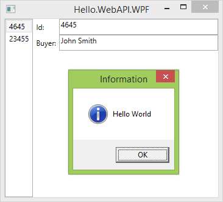

# hello.webapi.wpf

## Why?

Many companies need to maintain large codebases for legacy products like fat desktop clients with a two-tier client-server architecture. This makes migration to the web hard. Adding a REST Api to the desktop clients enables interoperability to web applications. Once the REST Api is in place, a gradual migration to a three-tier architecture is possible, at your own pace.

## What

An example on how to bring the Web and the Desktop together. Starting with a standard WPF application ([Caliburn.Micro](http://caliburnmicro.com/), [AutoFac](http://autofac.org/)) we add

- a [HTTP/REST Api](#rest-api) and
- a custom url [protocol handler](#protocol-handler)

## REST API

You can talk to the WPF application's [REST API](http://en.wikipedia.org/wiki/Representational_state_transfer) using your browser with the integrated [Swagger Ui](http://localhost:9000/swagger), [cURL](http://curl.haxx.se/), [PostMan](https://www.getpostman.com/) or any other http client.

Ingredients used are [Web Api](http://www.asp.net/web-api) and [OWIN Self Hosting](http://www.asp.net/web-api/overview/hosting-aspnet-web-api/use-owin-to-self-host-web-api).

### HTTP Get

Navigating to [http://localhost:9000/api/info?message=Hello World](http://localhost:9000/api/info?message=Hello%20World) shows up a standard WPF message box

.

### HTTP Post

Post a `Message` object like this

```json
{
    "Message":"Do you want to save?",
    "Caption":"Info",
    "Button":"YesNoCancel",
    "Icon":"Question"
}
```

### Message Controllers

For messages there are controllers for `info, warning, error` and `question`. Note that HTTP status code is not returned until user responds to the message box clicking a button. Return codes are `200 (Ok)` for `OK` or `Yes` and `401 (Unauthorized)` for anything else.

### Collection Controller

The most typical use case for REST is to expose a collection. Here, we added a simple `sales` controller. Use the standard HTTP verbs, e.g. a `GET`: like [http://localhost:9000/api/sales](http://localhost:9000/api/sales)

```json
[{"Id":4645,"Buyer":"John Smith"},{"Id":23455,"Buyer":"Mark Johnson"}]
```

or [http://localhost:9000/api/sales/4645](http://localhost:9000/api/sales/4645)

```json
{"Id":4645,"Buyer":"John Smith"}
```

Use `POST` to add, `PUT` for update and `DELETE` to remove a sale.

## Protocol handler

A custom url [protocol handler](https://docs.microsoft.com/en-us/archive/blogs/noahc/register-a-custom-url-protocol-handler) is a great way to launch (or activate) your application directly from your browser.

To install/register a protocol handler you need elevated privileges.
The example setup project does just that, so after installing you can bring a Windows terminal and type

```console
start "hellowpf://question/How are you?"
```

to bring up the application. Alternatively, from the browser check these links

- [hellowpf://question/How are you?](hellowpf://question/How are you?)
- [hellowpf://information/Hello World!](hellowpf://information/Hello World!)
- [hellowpf://warning/Do you really want to proceed?](hellowpf://warning/Do you really want to proceed?)
- [hellowpf://error/An error occurred.](hellowpf://error/An error occurred.)

## Links

- [Creating hybrid HTML5 and WPF applications with self-hosted OWIN Web API SignalR and Awesomium](http://galratner.com/blogs/net/archive/2014/01/31/creating-hybrid-html5-and-wpf-applications-with-self-hosted-owin-web-api-signalr-and-awesomium.aspx)
- [Use OWIN to Self-Host ASP.NET Web API 2](http://www.asp.net/web-api/overview/hosting-aspnet-web-api/use-owin-to-self-host-web-api)
- [Enabling Cross-Origin Requests in ASP.NET Web API 2](http://www.asp.net/web-api/overview/security/enabling-cross-origin-requests-in-web-api)
- [REST vs. RPC in ASP.NET Web API? Who cares; it does both](http://encosia.com/rest-vs-rpc-in-asp-net-web-api-who-cares-it-does-both/)
- [AutoFac Docs - Web API](http://docs.autofac.org/en/latest/integration/webapi.html)
- [domaindrivendev/Swashbuckle - Swagger for Web API](https://github.com/domaindrivendev/Swashbuckle)
- [Launching applications using custom browser protocols](https://support.shotgunsoftware.com/hc/en-us/articles/219031308-Launching-applications-using-custom-browser-protocols)
